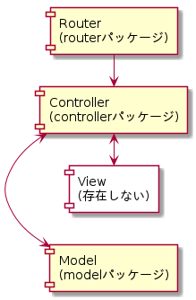

= Go言語で作ったWeb API(掲示板)

== 想定される用途
このWeb APIは、掲示板アプリのバックエンドとして使用します。  
Androidアプリの動作例↓  

image::https://i.imgur.com/XNlIJj7.gif["モバイルアプリの動例"]

== インストール
go getコマンドでインストールできます。

`go get github.com/yoshikit1996/go-webapi-bbs`

== 使い方
1. サーバーを起動する。
```
cd ~/go/src/github.com/yoshikit1996/go-webapi-bbs/
go build
go run main.go
```  
※ 必要に応じてgo getコマンドで依存しているパッケージをダウンロードしていください。また、Windowsで
`go get github.com/mattn/go-sqlite3`
コマンドを打つとエラーが発生します。解決策は
https://github.com/mattn/go-sqlite3/issues/214[こちら]。

2. モバイルアプリからアクセスする。
(https://github.com/yoshikit1996/android-bbs)

3. (モバイルアプリを使わない場合)https://www.getpostman.com/[Postman]等の開発ツールを使う。  
```
GETでJSONを取得する http://localhost:8080/posts
POSTでJSONを送信する http://localhost:8080/posts/new
```  
image::https://i.imgur.com/YoaqzVz.png[モバイルアプリの動例]

## モバイルアプリとWeb APIの連携
Web APIを通して、JSONの送受信を行っています。

image::https://i.imgur.com/OV41odz.jpg[モバイルアプリとWeb APIの連携]

== プログラム構造
このWeb APIはGo言語によって、実装されており、MVCアーキテクチャを適用しています。ただし、Web API側にビューは存在しません。(モバイルアプリ側に存在します。)  


